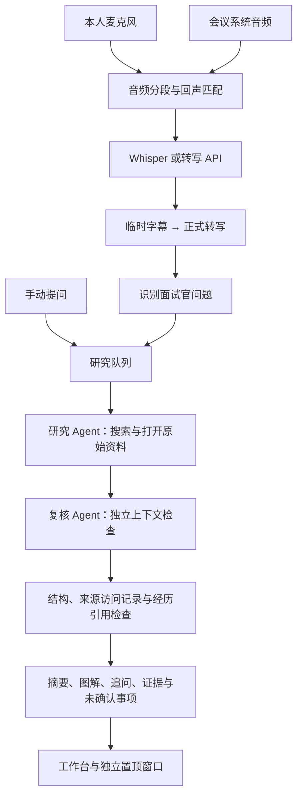

<p align="center">
  
</p>

<h1 align="center">面试助手 · Interview Copilot</h1>

<p align="center">专注对话，依据在旁。<br />双路实时转写 · 检索与独立复核 · 可多开的置顶问题卡片</p>

<p align="center">
  <a href="https://github.com/alexxxiong/interview-copilot/actions/workflows/ci.yml"></a>
  
  
  
</p>

在本机运行的面试辅助桌面应用，面向量化开发、架构设计和 AI 工程等技术面试。先把本人和会议对方的声音转成可修正文本，再由 Agent 检索原始资料、组织回答，并在独立调用中复核。回答以摘要、表达顺序和图解开头，细节与来源按需展开。

适用于模拟面试、技术备考，以及双方知情并允许使用辅助工具的面试。

> **项目状态：** 实验性 macOS 应用，主要在 Apple Silicon 上开发与验证。仓库提供源码，不含个人简历、面试记录、语音模型或已公证安装包。预置内容均为通用练习模板与方案参考。

## 功能

| 能力             | 行为                                                                                           |
| ---------------- | ---------------------------------------------------------------------------------------------- |
| 双路实时转写     | 麦克风默认对应本人，系统音频默认对应面试官；先显示临时字幕，再合并正式记录，可修正文字与角色。 |
| 音频回声去重     | 对两路声音做时间对齐与保守波形匹配，识别前移除已确认回声；不因文字相同删除真实复述。           |
| Agent 研究与复核 | 自动识别问题或手动提问，搜索并打开资料，起草后用独立上下文检查事实、反例、边界与经历依据。     |
| 问题卡片         | 22 张内置卡片，14 张带离线练习稿，覆盖一致性、P99、订单状态机、Go、K8s、RAG、MCP 与项目表达。  |
| 摘要优先         | 开场一句、30–60 秒说法、要点图、技术过程、追问和来源逐层展开，支持分类、搜索与收藏。           |
| 独立多窗口       | 点击卡片新开窗口，可打开多张或同一卡的多个副本，各自控制置顶、字号与滚动，支持平铺。           |
| 本机持久化       | 资料、会话、答案与题库缓存保存在本机；Agent 缓存随岗位和个人资料变化隔离。                     |

**只阅读预置稿即可体验卡片功能，无须登录模型或下载语音模型。** 联网问答、语音转写再分别配置。

## 快速开始

### 安装并启动

需要 macOS、Node.js **22.12+**（也可使用 Node.js 24）和 npm。建议使用 Apple Silicon；其他平台的桌面采集与打包未完成验证。

```bash
git clone https://github.com/alexxxiong/interview-copilot.git
cd interview-copilot
npm ci
npm start
```

进入「问题卡片」即可阅读内置练习稿。个人经历题中的 `【项目】`、`【职责】`、`【结果】` 是待填项，不代表任何人的真实经历。

### 配置研究 Agent

默认通过本机 Codex CLI 调用模型，需自行安装、登录并具备可用额度：

```bash
npm install -g @openai/codex
codex login
```

在「模型与设置」检查可执行文件路径、模型、推理强度和超时。模型名留空时使用 CLI 默认模型。应用依赖非交互调用、JSON Schema 输出与网页检索等能力；当前开发环境使用 `codex-cli 0.142.5`，其他版本需验证兼容性。

也可选择 Responses API，在界面填写服务地址、可用模型和 API Key。兼容服务必须支持 Responses、结构化输出和 `web_search`，仅兼容 Chat Completions 的服务不能直接替代。联网研究可能耗时几十秒到数分钟，并消耗所选服务额度。

### 配置本地语音识别

本地转写使用 [whisper.cpp](https://github.com/ggml-org/whisper.cpp)。安装脚本需要 Homebrew，会安装 `whisper-cpp` 并下载、校验约 466 MB 的多语言 small 模型：

```bash
npm run setup:asr
```

默认模型位置：`~/Library/Application Support/InterviewCopilot/models/ggml-small.bin`。

在设置中检查 `whisper-cli` 与模型文件路径。优先复用同目录下的 `whisper-server`；缺少 server 时可回退到 CLI 转写，但延迟通常更高。也可选择云端转写，音频会发送至配置的服务。

### 开始一场练习

1. 在「个人经历」填写真实资料，可参考 [个人资料模板](docs/PROFILE_TEMPLATE.md)。
2. 手动输入问题，观察研究、复核与终态，先验证模型配置。
3. 打开「音频采集设置」，检查麦克风与「录屏与系统录音」权限。
4. 在腾讯会议等软件中通话，点击「开始采集」。应用获取麦克风与本机系统音频，不需要会议插件。
5. 左侧查看双方文本，右侧阅读回答；点击卡片打开独立窗口，或用 `⌘ ⇧ J` 显示／隐藏实时提示窗。
6. 停止采集后，等待已入队音频转写完成，再切换会话。

**腾讯会议说明：** 接入方式是系统音频采集，不是官方会议集成。已验证本地与合成音频链路，真实腾讯会议外放通话尚未完成端到端验收。系统音频可能包含其他应用声音，不会只选择某个会议应用；双路来源也不等于多人声纹分离。

## Agent 如何工作



- **两个独立模型调用。** 研究完成后再复核，未复核草稿不直接作为最终答案展示。
- **引用检查访问记录。** “搜索到”不等于“已阅读”；访问记录也不能保证原文支持结论，仍需复核。
- **事实、设计与经历分开。** 经历依据来自用户资料，缺少事实时保留待补项，不把技术讨论当成项目经验。
- **失败明确可见。** 鉴权错误、超时、结构不符或来源不足显示对应状态，支持重试与取消。
- **离线稿与联网答案分开。** 阅读预置稿不创建 Agent 任务，点击「结合最新资料检索复核」才开始研究。

任务状态为 `queued → researching → reviewing → completed / needs_context / failed / cancelled`。`needs_context` 表示还有未确认事项；`completed` 也不保证答案绝对正确。

Codex 调用使用临时工作目录与受限配置，关闭 shell、子 Agent、hooks 和应用连接器。研究与复核围绕网页检索进行，不需要访问当前代码仓库或其他本机文件。

## 字幕、去重与窗口

**字幕：** 说话期间约每 2 秒提交音频快照，临时文本可被修正；停顿约 0.9 秒后定稿，长句最多约每 18 秒分段。实际速度取决于硬件、模型和负载。只有正式的面试官发言进入问题识别，临时字幕不触发研究。

**去重：** 在约 800 ms 的延迟范围内做保守回声匹配，只使用已成功转写的系统音频作参照。独立声音、真实复述与未确认的重叠语音保留；混响、失真或较大延迟仍可能留下重复内容。它不是声纹识别，也不是通用声学回声消除器。

**窗口：** 每张卡绑定打开时的问题与会话，工作台切换不会替换已开卡片。平铺按鼠标所在显示器排列。关闭、最小化与全屏使用 macOS 原生按钮；普通桌面支持置顶并保留 Dock 图标，不强行覆盖其他应用的原生全屏窗口。浏览器模式不提供同等跨应用置顶能力。

## 数据与隐私

| 数据             | 保存与发送方式                                                                   |
| ---------------- | -------------------------------------------------------------------------------- |
| 资料、对话与答案 | 本机保存；提问时相关资料和对话上下文会发送给选定的模型服务。                     |
| 麦克风与系统音频 | 默认本地 Whisper；选择云端转写时发送给配置的语音服务。                           |
| 音频片段         | 用于内存队列及临时文件，正常处理后清理；失败片段可在当前窗口重试。               |
| 屏幕画面         | 系统音频采集可能触发录屏指示；应用不保存或上传屏幕画面。                         |
| API Key          | 桌面模式通过 Electron `safeStorage` 加密落盘；浏览器模式只在后端当前进程内保留。 |

桌面数据通常位于 `~/Library/Application Support/面试助手/interview-data/`，源码浏览器模式默认使用 `.data/`。HTTP 服务仅监听 `127.0.0.1`，包含 Host、Origin 和写请求令牌检查，不应直接作为公网服务部署。

`.gitignore` 排除本机数据、个人资料、录音、文档、密钥、测试产物与构建包。公开模板不含开发者个人经历；反馈问题时也请去除个人资料、原始对话和凭据。

## 开发与打包

```bash
npm run dev           # Vite 5173 + 后端 4318，浏览器开发模式
npm run build         # TypeScript 检查 + Vite 构建
npm run web           # 构建并运行本机网页服务，默认 4318
npm start             # 构建并启动 Electron
npm run icons:build   # macOS：生成 PNG、ICNS 与 Retina iconset
npm run package:mac   # macOS：为当前机器架构生成 .app
```

Apple Silicon 产物为 `release/mac-arm64/面试助手.app`。构建使用 ad-hoc 签名，**尚未配置 Developer ID 签名与公证**，仓库不提供已验证的通用安装包。

| 配置                       | 作用                                                           |
| -------------------------- | -------------------------------------------------------------- |
| `INTERVIEW_PORT`           | 后端端口，默认 `4318`；桌面版和网页服务可用。                  |
| `INTERVIEW_DATA_DIR`       | Electron 桌面版数据目录；单独运行网页服务仍默认使用 `.data/`。 |
| `INTERVIEW_E2E_EXECUTABLE` | E2E 测试指定打包后的 Electron 可执行文件。                     |

开发代理默认指向 `4318`。设置通过界面管理，项目不会自动加载 `.env`。运行开发版前请退出占用同一端口的桌面应用；多个桌面实例需要独立端口、数据目录和 Electron 用户目录。

```text
src/          React 工作台、卡片、音频采集与去重
server/       本机 API、Agent 队列、来源检查与转写
electron/     原生窗口、系统音频授权与密钥加密
public/       AudioWorklet 与应用标识
assets/       图标主稿、ICNS 与 entitlement
scripts/      模型安装、图标打包与可选真实链路验证
tests/        单元、集成与可选桌面测试
docs/         资料模板与验证说明
```

## 测试

```bash
npm test                 # 默认单元与集成测试，不调用付费模型
npm run build            # 类型检查与生产构建
npm run test:e2e          # 需 macOS 图形环境；不采集真实麦克风
npm run test:live         # 真实研究与复核，需 Codex 登录，会消耗额度
npm run test:captions     # 本地 Whisper + 音频夹具
npm run test:echo         # 回声去重 + 本地 Whisper
npm run test:audio        # Electron 采集代码 + 合成音轨
```

后三项需要自行提供 `artifacts/asr-test.wav`：16 kHz、单声道、16-bit PCM WAV，内容包含“高频”“量化”或“订单”等词，并安装本地 Whisper 和模型。不会自动下载个人录音。默认测试中的真实音频夹具用例在文件不存在时跳过。

CI 在干净检出中运行 `npm ci`、`npm test` 与 `npm run build`，不调用真实模型，也不代表系统录音权限或真实会议已验收。详细范围见 [验证说明](docs/VALIDATION.md)。

## 常见问题

**授权开关已开启，为什么没有系统声音？**

在「音频采集设置」查看实际权限，播放「测试系统声音」检查音轨。更改权限后退出并重开。ad-hoc 包重新打包可能改变签名身份，使旧权限失效；此时在系统设置移除旧条目，重新添加当前 `.app` 后重开。窗口打开不等于音频采集成功。

**可以完全离线使用吗？**

预置稿和配置完成后的本地转写可以离线使用。模型研究需要网络，预置稿不能当作最新检索结论。

**能用在 Windows 或 Linux 吗？**

部分网页界面和后端测试可运行，但桌面采集、授权、置顶和打包主要按 macOS 实现，尚未完成其他平台的完整验证。

**为什么有时显示“待确认”？**

资料不足、引用缺少本轮访问记录、个人经历缺失或复核发现边界问题时，应用保留未确认事项。补充上下文后重新检索，不把状态文案当作事实证明。

## 参与与许可

欢迎通过 [Issues](https://github.com/alexxxiong/interview-copilot/issues) 提供可复现的问题或建议。提交前运行 `npm test` 和 `npm run build`，不要提交 `.data/`、`artifacts/`、`release/`、`资料/`、真实录音或个人资料。

当前仅公开代码，尚未附加开源许可证；第三方依赖遵循各自许可证。图标由内置图像生成工具制作，主稿及提示词见 [图标设计记录](assets/icon-design.md)。
